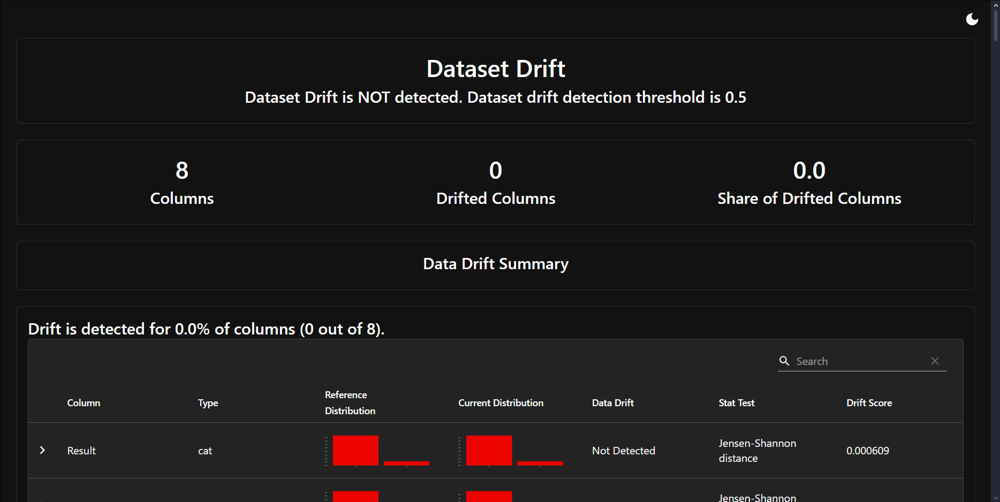

# Basic-mlops-project
This project aim to predict which customers are most likely to purchase additional insurance products using a list of machine learning model.
The project follow a simple Mlops pipeline from data ingestion to model deployment. 
## Getting Started
### 1. Clone the repository
```bash
git clone https://github.com/Khoa224/basic-mlops-project.git
cd basic-mlops-project
```
### 2. Install the required libraries
This project use Python 3.9. Create a virtual environment and install the required libraries.
```bash
pip install requirement.txt
```

### 3. Data preparation
Pull data on dvc if the data is not in the data folder
```bash
dvc pull
```
### 4. Train the model
```bash
python main.py
```
This script will load, preprocess the data, train the model and save the model in the models folder.

### 5. Deploy the model
Start FastAPI application
```bash
uvicorn app:app --reload
```

###6. Docker
Build the docker image
```bash
docker build -t insurance-prediction .
```
Run the container
```bash
docker run -d -p 80:80 insurance-prediction
```
###7. Monitor the model
Using Evidently AI to monitor the model for data drift and degradation
```bash
python monitor.py
```
Example of data drift between training and test/production data
- Test drift

- Production drift


